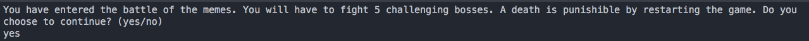

# Final-Project

## Synopsis

This project is a fun text baised adventure.

## Code Example

An example of what you are going to be doing would be a quote from the adventure. I chose this because it is a perfect example of how I wrote the story. 
```
You pull out the ancient book of scripture, found in the deepest Hebrew cave. You flip through the pages then read the sacred phrase, No U." I chose this because it is a perfect example of how I wrote the story.

```

## How to Play

All you need to do is type in your choice when prompted. For example, type attack if you want to attack and type defend when you want to defend.


## Motivation

I have had all of these great ideas for a story and needed a place to put them all together.

## Installation

All you need to do is download the java file and run it.

## Contribution guideline

If you want to contribute to this all you need to do is download it and edit it to your pleasure. Just make to sure to mention me.

## Contributors

The person who helped me by giving me some of his creative insight is Dalyn Dalton.
